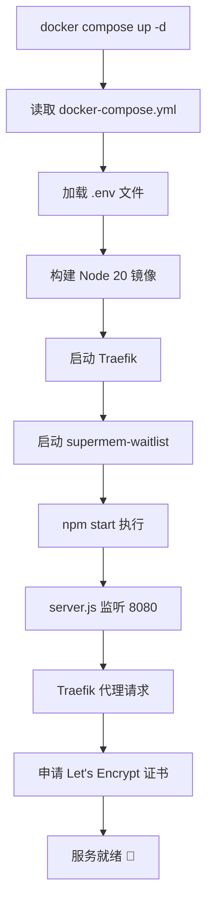

# 🚀 启动指南

## 📋 环境要求

- Docker 20.10+
- Docker Compose 2.0+
- Node.js 20+ (已在 Docker 镜像中)

## 🔧 配置步骤

### 1. 创建环境变量文件

```bash
# 复制示例文件
cp .env.example .env

# 编辑配置
nano .env
```

**`.env` 文件内容：**
```env
# Supabase Configuration
SUPABASE_URL=https://your-project.supabase.co
SUPABASE_ANON_KEY=eyJhbGciOiJIUzI1NiIsInR5cCI6IkpXVCJ9...

# NODE_ENV 会自动设置为 production，无需在这里配置
```

### 2. 确认 DNS 配置

确保以下 DNS 记录已添加：

```
类型: A
名称: @
内容: YOUR_SERVER_IP

类型: A
名称: www
内容: YOUR_SERVER_IP
```

### 3. 启动服务

```bash
# 方式 1: 前台运行（查看日志）
docker compose up

# 方式 2: 后台运行
docker compose up -d

# 查看日志
docker compose logs -f
```

## ✅ 验证部署

### 检查容器状态
```bash
docker compose ps
```

期望输出：
```
NAME                  STATUS
supermem-traefik      Up
supermem-waitlist     Up
```

### 测试服务
```bash
# 测试主域名
curl https://supermem.io/api/health

# 测试 www 域名
curl https://www.supermem.io/api/health
```

## 🔍 启动命令说明

### Dockerfile
```dockerfile
FROM node:20-alpine          # 使用 Node.js 20
WORKDIR /app
COPY package*.json ./
RUN npm ci --only=production # 安装生产依赖
COPY . .
EXPOSE 8080
CMD ["npm", "start"]         # 启动命令：npm start
```

### docker-compose.yml
```yaml
supermem-waitlist:
  build: .                   # 构建镜像
  env_file:
    - .env                   # 从 .env 文件加载环境变量
  environment:
    - NODE_ENV=production    # 设置生产环境
  restart: unless-stopped    # 自动重启
```

### 环境变量加载顺序

1. **`.env` 文件** → 主要配置（SUPABASE_URL, SUPABASE_ANON_KEY）
2. **`environment`** → 覆盖配置（NODE_ENV=production）

## 🔧 常用命令

### 启动和停止
```bash
# 启动服务
docker compose up -d

# 停止服务
docker compose down

# 重启服务
docker compose restart

# 重启特定服务
docker compose restart supermem-waitlist
```

### 查看日志
```bash
# 查看所有日志
docker compose logs -f

# 查看特定服务日志
docker compose logs -f supermem-waitlist
docker compose logs -f traefik

# 查看最近 100 行
docker compose logs --tail=100 supermem-waitlist
```

### 更新应用
```bash
# 停止服务
docker compose down

# 拉取最新代码（如果使用 git）
git pull

# 重新构建镜像
docker compose build --no-cache

# 启动服务
docker compose up -d
```

### 调试
```bash
# 进入容器
docker compose exec supermem-waitlist sh

# 查看环境变量
docker compose exec supermem-waitlist env

# 查看 Node 版本
docker compose exec supermem-waitlist node --version

# 测试服务
docker compose exec supermem-waitlist wget -O- http://localhost:8080/api/health
```

## 🆘 故障排查

### 问题 1: 容器启动失败

```bash
# 查看详细日志
docker compose logs supermem-waitlist

# 检查配置
docker compose config

# 检查环境变量
docker compose exec supermem-waitlist env | grep SUPABASE
```

### 问题 2: 环境变量未加载

```bash
# 确认 .env 文件存在
ls -la .env

# 重新加载环境变量
docker compose down
docker compose up -d

# 进入容器检查
docker compose exec supermem-waitlist env
```

### 问题 3: 端口冲突

```bash
# 检查端口占用
sudo netstat -tulpn | grep -E ':(80|443|8080)'

# 停止冲突的服务
sudo systemctl stop nginx
sudo systemctl stop apache2
```

### 问题 4: 证书申请失败

```bash
# 查看 Traefik 日志
docker compose logs traefik | grep -i error

# 检查 DNS
dig supermem.io

# 确认 80 端口可访问
curl -I http://supermem.io
```

## 📊 性能监控

### 查看资源使用
```bash
# 实时资源监控
docker stats

# 查看特定容器
docker stats supermem-waitlist

# 查看磁盘使用
docker system df
```

### 查看访问日志
```bash
# Traefik 访问日志
docker compose logs traefik | grep "GET\|POST"

# 应用日志
docker compose logs supermem-waitlist
```

## 🔄 开发环境启动

如果在开发环境测试：

```bash
# 本地开发（不使用 Docker）
npm install
npm start

# 使用开发环境配置
NODE_ENV=development npm start

# 监听所有网络接口
HOST=0.0.0.0 PORT=8080 npm start
```

## 📝 环境变量说明

| 变量名 | 说明 | 示例 | 必需 |
|--------|------|------|------|
| `SUPABASE_URL` | Supabase 项目地址 | `https://xxx.supabase.co` | ✅ |
| `SUPABASE_ANON_KEY` | Supabase 公钥 | `eyJhbG...` | ✅ |
| `NODE_ENV` | Node 环境 | `production` | ⚠️ 自动设置 |

## ✨ 启动流程



## 🎯 快速开始（一键脚本）

创建 `start.sh`:
```bash
#!/bin/bash

# 检查 .env 文件
if [ ! -f .env ]; then
    echo "❌ .env 文件不存在"
    echo "请先创建 .env 文件："
    echo "  cp .env.example .env"
    echo "  nano .env"
    exit 1
fi

# 启动服务
echo "🚀 启动服务..."
docker compose up -d

# 等待服务启动
echo "⏳ 等待服务启动..."
sleep 5

# 检查状态
echo ""
echo "📊 容器状态："
docker compose ps

echo ""
echo "📝 查看日志："
echo "  docker compose logs -f"

echo ""
echo "✅ 访问："
echo "  https://supermem.io"
echo "  https://www.supermem.io"
```

使用方法：
```bash
chmod +x start.sh
./start.sh
```

---

**现在你可以轻松启动服务了！** 🚀

